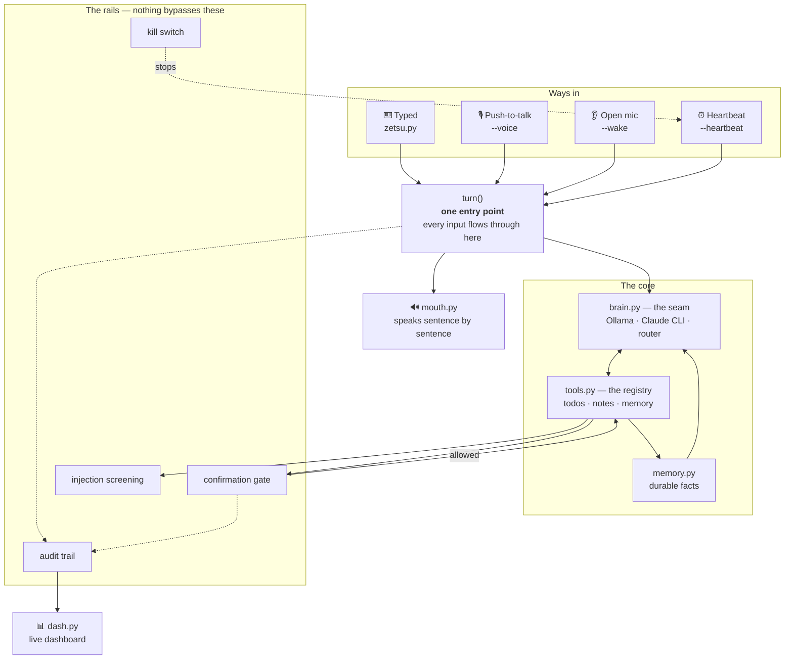
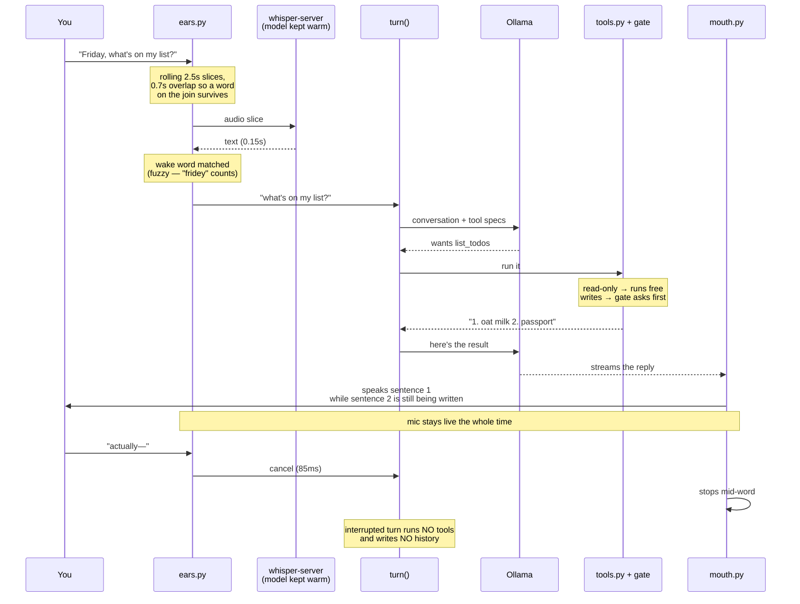
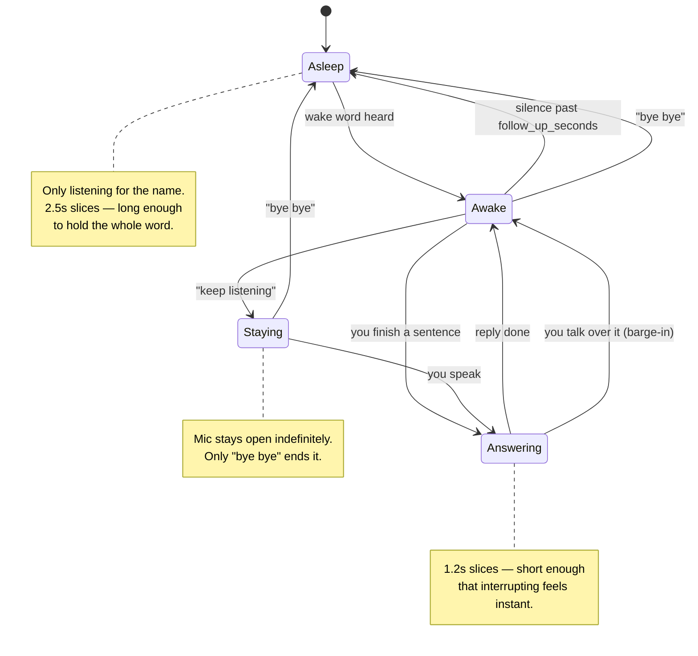
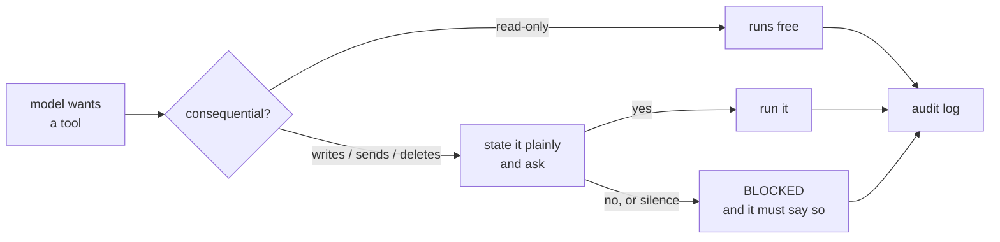

# Zetsu

**A voice-first assistant that runs entirely on your own machine.** No API keys, no
accounts, no audio leaving the laptop.

Say the wake word. Ask for something. Keep talking — it stays listening for a
follow-up instead of making you summon it before every sentence. Talk over it and
it stops mid-word.

```
you  › Friday, what is on my todo list?
zetsu› Your open todos are to buy oat milk and to renew your passport.
you  › How do I take my coffee?          ← no wake word needed
zetsu› With oat milk.
you  › Actually — wait                    ← spoken over the reply; it stops
zetsu› …
you  › Bye bye.
zetsu› Alright. Say my name when you need me.
```

---

## Why this is not the usual voice-agent demo

Most voice assistant projects are a microphone glued to an API key. Zetsu is built
the other way round: a working text agent first, with voice as a layer on top that
never forks the logic. That ordering is what makes everything below possible.

| | Typical voice demo | Zetsu |
|---|---|---|
| Where it runs | Cloud STT + cloud LLM + cloud TTS | **Entirely local.** Nothing is uploaded |
| Cost per turn | $0.01–0.10 | **$0.00** |
| Works offline | No | **Yes** |
| Interrupting it | Wait for it to finish | **Talk over it** — stops in 85ms |
| Hearing itself | Interrupts itself, or goes deaf while talking | **Recognises its own echo** and ignores it |
| Tool safety | Model calls tools freely | **Gate stops every consequential action** and asks |
| Prompt injection | Usually unconsidered | **Screened, flagged and logged** |
| Memory | Session only | **Plain-text facts you can edit by hand** |
| Proactivity | None | **Heartbeat** that can speak up on its own |
| Auditability | Console logs | **Full audit trail** of every action and why |
| Debuggability | Talk to it and hope | **Text path always works**; `--selftest` needs no mic, model, or network |

The last row matters more than it looks. Every layer here is independently runnable
and independently testable. That is the difference between a demo and something you
leave running.

---

## Architecture

Five parts, each wrapping the last. Voice and proactivity are *adapters on the
edges* — they never reimplement the middle.



**The discipline:** one shared agent core, many ways in and out. A typed turn, a
spoken turn, and a turn the heartbeat starts on its own all run the same `turn()`.
If the agent logic were ever written twice, that would be the bug.

---

## How a spoken turn actually works



---

## The conversation state machine

Wake once. It stays with you until the conversation actually ends.



---

## The measured numbers

Everything here was timed on an M1 MacBook Air with 8 GB of RAM.

### Speech recognition is 8× faster because the model stays loaded

`whisper-cli` reloads a 141 MB model on every single slice. The giveaway is that
0.65s of audio took **1.26s**, but 3.26s of audio took only **1.39s** — almost all
of it was startup, not listening.

| | per slice |
|---|---|
| reloading the model each time | 1.26s |
| kept warm in `whisper-server` | **0.15s** |

The one slow load happens at launch, deliberately. If the server will not start, it
falls back to per-slice loading and keeps working.

### Two brains, chosen per turn

| | first token | cost | notes |
|---|---|---|---|
| Ollama `qwen2.5:3b` | **0.23s** | free | offline, streams, cancellable mid-sentence |
| Claude CLI `sonnet-5` | 1.8s | ~$0.027/call | much sharper, no streaming, uses your CLI login |

`[model] backend = "auto"` keeps turns local by default and escalates only when the
request looks like it needs a bigger model (`[router]` rules). **Voice always uses
the local model** — the CLI cannot stream and cannot be cancelled mid-call, which
would break barge-in.

### RAM is handed back when you quit

The model is 2.2 GB resident — a quarter of an 8 GB machine. Warm while you are
talking to it is the point; warm while you are not is a tax on everything else you
have open. `release_on_exit = true` returns it the moment Zetsu exits.

---

## Key features

### Continuous listening, not slices
There is no chunking. One audio stream runs for the whole session and frames are
measured as they arrive, so a turn ends when you **stop talking** rather than when
a fixed window happens to close. This was the single biggest win in the project:

| | before | after |
|---|---|---|
| you stop → endpoint | ~1670 ms | **0 ms** (detected as it happens) |
| endpoint → transcript | 0 ms | **214 ms** |
| transcript → first token | — | **64 ms** |
| first token → sound | 869 ms | **~226 ms** |
| **heard-to-heard** | **2865 ms** | **~500 ms** |

The lesson was that none of the *computation* was ever slow — VAD 2 ms, STT 118 ms,
first token 64 ms, synthesis 51 ms, 235 ms of compute all in. The system spent its
time **waiting** for fixed-length windows. Replacing them deleted 124 lines and a
whole class of device-handover bug along with the latency.

### Barge-in that actually works on a laptop
Speaking over the reply cancels it **mid-stream** in 85ms — not after the sentence,
not after the paragraph.

The hard part is not stopping. It is that a laptop speaker feeds the assistant's own
voice back into its own microphone. Naively, it interrupts itself constantly. Zetsu
solves that by having the mouth **remember what it just said** and the ears discard
anything that resembles it — compared both by word overlap and by character
similarity, because the round trip through the air mangles words ("Obito" comes back
as "A bito"). While it is actually speaking, the bar for believing an interruption is
raised further.

*Measured: 5 self-interruptions in one conversation → 0.*

### A safety gate nothing bypasses
Anything that **sends, spends, deletes, writes a file or runs a shell command** stops
and states plainly what it intends, then waits.



Three properties that are easy to get wrong:
- **Gated in code, not config.** A new consequential tool is gated whether or not
  anyone remembers to update `config.toml`. `[gate] unattended` is the only way to
  loosen it, one named tool at a time.
- **Per-action.** Approving one send never pre-authorises the next.
- **Silence means no.** Answer out loud, or it defaults to denied after the timeout.
  A gate that waits forever for someone who is not there is a gate that quietly
  stops working.

And when it is blocked, it has to **tell you** — an early version cheerfully claimed
success for something that never ran, which is worse than a crash.

### It does not take orders from your files
Anything read from the outside world is data, never instruction. Text that looks like
it is giving orders is flagged to the model *and* to you, and logged.

Tested with a planted note: it answered the real question, refused the instruction,
said *"that's not a request from you"*, and never touched the todo list.

### Memory you can open and fix
Durable facts live in `state/memory.md`. One fact per line, plain text. Open it,
correct a line, delete one — it respects the edit next run. Facts are loaded as
**knowledge, never instructions**, so a stored note reading "always do X" cannot walk
around the gate.

### A heartbeat that earns its interruptions
Runs checks on its own schedule. Notices are **held** if you were away rather than
fired into the void, respect quiet hours, and can now be **spoken aloud** when the
mic is live. `/pause` — or Mute on the dashboard — stops all of it without tearing
anything down.

### A voice that sounds like a person
Speech runs through **Piper**, a neural voice that runs locally — no account, no
network, no per-word cost. Its model is loaded once and kept in memory: 0.07–0.24s a
sentence, against 0.95s if reloaded each time. `say` remains the automatic fallback.

### It can reach your actual life
Beyond its own todo list, it reads your **real calendar**, reads and writes **Apple
Reminders** (so things reach your phone), and reports on the machine itself — battery,
disk, time. Calendar and reminder *writes* are gated like everything else
consequential; reads run free.

### A dashboard that shows what it is doing
`--dash` serves a local page with a WebGL ring that reflects the live state: still
when idle, cyan listening, violet hearing you, amber thinking (with elapsed time and
a bar against how long it usually takes), green replying. Start / Mute / Stop
controls for the mic. Below it: todos, memory, pending notices, spend today, and the
audit trail. Bound to `127.0.0.1` only.

### It learns how *you* say the wake word
Whisper has never seen a made-up name and spells it differently every time.
`--calibrate` records you saying it three times and learns the actual strings.
`--misses` shows what *nearly* woke it, so you can add the real spellings instead of
guessing.

---

## Everything you can run

```bash
./.venv/bin/python zetsu.py             # type at it — the best way to debug
./.venv/bin/python zetsu.py --voice     # push to talk: Enter, speak, Enter
./.venv/bin/python zetsu.py --wake      # open mic + barge-in
./.venv/bin/python zetsu.py --dash      # http://localhost:8765
./.venv/bin/python zetsu.py --heartbeat # proactive checks
./.venv/bin/python zetsu.py --calibrate # teach it how you say the wake word
./.venv/bin/python zetsu.py --misses    # what nearly woke it
./.venv/bin/python zetsu.py --selftest  # no mic, no model, no network needed
```

Console commands while talking: `/pause` `/resume` `/audit` `/status` `/quit`.

---

## The files

| file | what it owns |
|---|---|
| `zetsu.py` | `turn()` and every front end. The only place a conversation is driven |
| `brain.py` | **the model seam.** The only file that knows which backend is in use |
| `tools.py` | the registry. Adding a capability means one function here, nothing else changes |
| `ears.py` | audio in. Rolling overlapped capture, whisper server, wake matching |
| `mouth.py` | audio out. Sentence-by-sentence speech, and echo memory |
| `memory.py` | durable facts, as plain text |
| `heartbeat.py` | the schedule, held notices, quiet hours |
| `rails.py` | gate policy, audit log, kill switch, injection screening |
| `live.py` | what it is doing right now, for the dashboard |
| `dash.py` | the local page |
| `config.py` | settings and paths, in one place |

**One optional Python dependency** (`piper-tts`, for the neural voice) plus local
binaries. Everything else is the standard library — and if Piper is missing, speech
falls back to the built-in `say` rather than failing.

Every provider sits behind a one-function seam. Swapping Ollama for something else,
or `say` for a neural voice, is a rewrite of one function — not a refactor.

---

## Requirements

- macOS (uses `say`, `afplay`, and AVFoundation for audio)
- Python 3.11+ (for `tomllib`)
- [Ollama](https://ollama.com)
- `ffmpeg` and `whisper-cpp`

## Setup

```bash
brew install ffmpeg whisper-cpp
ollama pull qwen2.5:3b

# the neural voice (optional — it falls back to the system voice without it)
.venv/bin/pip install piper-tts
mkdir -p models/piper
curl -L -o models/piper/en_US-amy-medium.onnx \
  https://huggingface.co/rhasspy/piper-voices/resolve/main/en/en_US/amy/medium/en_US-amy-medium.onnx
curl -L -o models/piper/en_US-amy-medium.onnx.json \
  https://huggingface.co/rhasspy/piper-voices/resolve/main/en/en_US/amy/medium/en_US-amy-medium.onnx.json

# the Whisper model is not in this repo — it is 141MB, over GitHub's file limit
mkdir -p models
curl -L -o models/ggml-base.en.bin \
  https://huggingface.co/ggerganov/whisper.cpp/resolve/main/ggml-base.en.bin

python3 -m venv .venv
```

Then talk to it in text first. Voice is a layer on top of a working agent, never the
foundation:

```bash
./.venv/bin/python zetsu.py
```

## Configuration

Everything tunable lives in `config.toml` — the model, the voice, the wake word and
its near-misses, slice lengths, barge-in thresholds, quiet hours, router rules, and
which tools require confirmation. You will tune these often; none of it should ever
require touching code.

`AGENT.md` records what was built, in what order, and why.

## RAM

The language model is ~2.2 GB resident. On an 8 GB machine that matters, so it is
**handed back the moment Zetsu exits** (`release_on_exit`). Ollama does not run at
login, so nothing is held when you are not using it. Check with `ollama ps` — empty
means nothing loaded.

## A note on headphones

Echo suppression is good enough that laptop speakers work. Headphones make the
problem disappear entirely, and barge-in becomes flawless.
